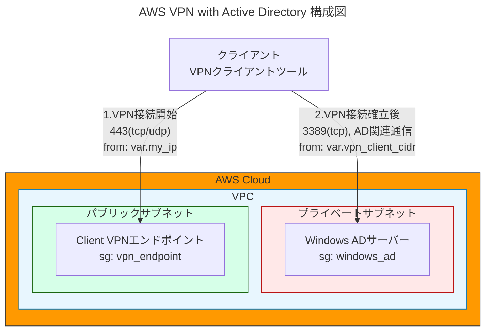

# AWS Windows Server AD 環境構築 (Terraform)

このプロジェクトは、Terraform を使用して AWS 上に Windows Server をEC2インスタンスで構築し、Active Directory を設定するためのスクリプトを提供します。

## 前提条件

- Terraform がインストールされていること (`terraform --version` で確認)
- AWS CLI がインストールされ、適切な権限のある AWS アカウントに認証されていること (`aws configure` で設定)

## 構成

```
# tree --dirsfirst -F
./
├── environments/
│   └── poc/
│       ├── client-vpn-config.ovpn
│       ├── main.tf
│       ├── outputs.tf
│       ├── terraform.tfvars
│       ├── terraform.tfvars.sample
│       └── variables.tf
├── modules/
│   ├── common/
│   │   └── outputs.tf
│   ├── compute/
│   │   ├── main.tf
│   │   ├── outputs.tf
│   │   ├── variables.tf
│   │   └── windows_ad_key.pem
│   ├── iam/
│   │   ├── main.tf
│   │   └── outputs.tf
│   ├── network/
│   │   ├── main.tf
│   │   ├── outputs.tf
│   │   └── variables.tf
│   └── vpn/
│       ├── scripts/
│       │   ├── create-vpn-ovpn.sh*
│       │   ├── generate-vpn-certs.sh*
│       │   └── terraform.tfstate
│       ├── vpn-certs/
│       │   ├── ca.crt
│       │   ├── ca.key
│       │   ├── client.crt
│       │   ├── client.key
│       │   ├── server.crt
│       │   └── server.key
│       ├── main.tf
│       ├── outputs.tf
│       └── variables.tf
├── README.md
├── VPN_README.md
└── userdata.ps1
```

## 使用方法（POC環境）

### 1. 環境ディレクトリに移動

```sh
cd environments/poc
```

### 2. 証明書生成スクリプトを実行

```bash
# ドメイン名を指定して実行する
../../modules/vpn/scripts/generate-vpn-certs.sh -d sample.local
```

### 3. Terraform の初期化

```sh
terraform init
```

### 4. 環境変数の設定

terraform.tfvars ファイルを作成し、必要な変数を設定します：
```hcl
my_ip                = "自分のIP/32"  # curl -s https://checkip.amazonaws.com で取得可能
domain_name          = "example.com"
domain_netbios_name  = "EXAMPLE"
windows_ami          = "ami-xxxxxxxx"  # 手順5で取得するAMI ID
```

### 5. Windows Server 2019 日本語版の AMI 確認

```sh
aws ec2 describe-images \
  --owners "amazon" \
  --filters "Name=name,Values=Windows_Server-2019-Japanese-Full-Base-*" \
  --query "Images | sort_by(@, &CreationDate) | [-1].ImageId" \
  --region ap-northeast-1
```

取得した AMI ID を `terraform.tfvars` の `windows_ami` に設定してください。

### 6. RDP 接続用に自分の IP を取得

Terraform 実行前に、自分のグローバル IP アドレスを取得し、環境変数として設定します。

```sh
echo $(curl -s https://checkip.amazonaws.com)/32
```

これにより、自分のグローバル IP のみを RDP 接続許可対象にできます。

### 7. Terraform Plan で変更内容を確認

```bash
terraform plan \
  -var-file="terraform.tfvars" \
  -var="my_ip=$(curl -s https://checkip.amazonaws.com)/32"
```

### 8. インフラの適用

```bash
terraform apply \
  -var-file="terraform.tfvars" \
  -var="my_ip=$(curl -s https://checkip.amazonaws.com)/32" \
  -auto-approve
```

実行後、以下のリソースが作成されます：
- Windows Server 2019 EC2インスタンス（Active Directory）
- Client VPN エンドポイント
- 必要な証明書（自動生成）
- OpenVPN設定ファイル

### 9. VPN接続の設定

1. Terraform実行完了後、terraform 実行ディレクトリに `client-vpn-config.ovpn` が生成されます
2. この設定ファイルをOpenVPNクライアントにインポートします
3. VPN接続を開始し、プライベートサブネットにアクセスできることを確認します

### 11. Windows Server への接続

Terraform の出力にある `windows_ad_public_ip` を使用し、リモートデスクトップで接続します。
IDは Administrator で、パスワードは、以下AWS CLIで取得できます。

```bash
aws ec2 get-password-data --instance-id <インスタンスID> --priv-launch-key windows_ad_key.pem
```

## クリーンアップ

作成したリソースを削除する場合:

```sh
terraform destroy \
  -var-file="terraform.tfvars" \
  -var="my_ip=$(curl -s https://checkip.amazonaws.com)/32"
```

## AWS構成図



## 注意事項

- AWS のコストが発生するため、不要な場合は `terraform destroy` で削除してください。
- `userdata.ps1` の `YourSecurePassword!` は適切なものに変更してください。
- VPN証明書は自動生成されますが、運用環境では適切な証明書管理が必要です。
- Client VPN エンドポイントには別途料金が発生します。

## ライセンス

MIT
